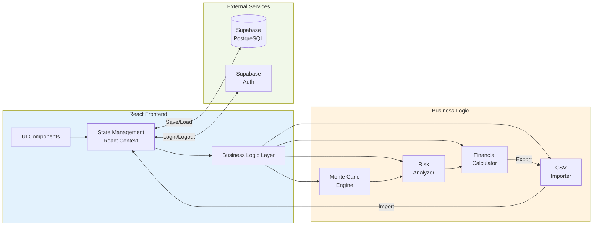

# Design Document: Inventory Risk Predictor AI

## Overview

The Inventory Risk Predictor AI is a React-based web application that leverages Monte Carlo simulation to predict inventory risks and optimize inventory management decisions. The system architecture follows a client-side simulation approach with cloud-based data persistence through Supabase.

The core innovation is the use of stochastic simulation to model real-world inventory uncertainty. Rather than deterministic calculations, the system runs 100 independent simulations over 365 days, each with randomized demand and lead times, to generate probability distributions of inventory outcomes. This approach provides inventory managers with confidence intervals and risk probabilities rather than single-point estimates.

The application is designed for inventory managers, financial analysts, and executives who need to:
- Understand inventory risk exposure across their product portfolio
- Quantify financial impacts of overstock and stockout scenarios
- Test what-if scenarios to optimize reorder points and order quantities
- Make data-driven decisions about inventory investments

## Architecture

### High-Level Architecture

```
┌─────────────────────────────────────────────────────────────┐
│                     React Frontend (Vite)                    │
│  ┌────────────────────────────────────────────────────────┐ │
│  │              UI Layer (shadcn/ui + Tailwind)           │ │
│  │  - Dashboard  - SKU Detail  - Simulator  - Input      │ │
│  └────────────────────────────────────────────────────────┘ │
│  ┌────────────────────────────────────────────────────────┐ │
│  │                  Application Layer                      │ │
│  │  - State Management (React Context)                    │ │
│  │  - Currency Provider                                   │ │
│  │  - Auth Provider                                       │ │
│  └────────────────────────────────────────────────────────┘ │
│  ┌────────────────────────────────────────────────────────┐ │
│  │                   Business Logic Layer                  │ │
│  │  ┌──────────────────┐  ┌──────────────────┐           │ │
│  │  │ Monte Carlo      │  │ Risk Analyzer    │           │ │
│  │  │ Engine           │  │                  │           │ │
│  │  └──────────────────┘  └──────────────────┘           │ │
│  │  ┌──────────────────┐  ┌──────────────────┐           │ │
│  │  │ Financial        │  │ CSV Importer     │           │ │
│  │  │ Calculator       │  │                  │           │ │
│  │  └──────────────────┘  └──────────────────┘           │ │
│  └────────────────────────────────────────────────────────┘ │
└─────────────────────────────────────────────────────────────┘
                              │
                              │ HTTPS
                              ▼
                    ┌──────────────────┐
                    │    Supabase      │
                    │  - Auth          │
                    │  - PostgreSQL    │
                    └──────────────────┘
```

### Component Responsibilities

**UI Layer:**
- Renders interactive dashboards and charts using Recharts
- Handles user input and form validation
- Provides responsive design with Tailwind CSS
- Animates transitions with Framer Motion

**Application Layer:**
- Manages global state (inventory data, user preferences, auth state)
- Provides context providers for currency and authentication
- Coordinates between UI and business logic

**Business Logic Layer:**
- Monte Carlo Engine: Executes stochastic simulations
- Risk Analyzer: Calculates risk probabilities and classifications
- Financial Calculator: Computes carrying costs and stockout losses
- CSV Importer: Parses and validates inventory data files

**Data Layer (Supabase):**
- Authentication and user management
- Persistent storage of SKU data and user preferences
- Row-level security for multi-tenant data isolation

### Process Flow

The following diagram illustrates the core workflow from data input through simulation to risk analysis and recommendations:

```mermaid
flowchart TD
    Start([User Input]) --> Input{Input Method}
    
    Input -->|Manual Entry| ManualForm[Manual SKU Form]
    Input -->|CSV Upload| CSVUpload[CSV File Upload]
    
    ManualForm --> Validate[Validate Input Data]
    CSVUpload --> ParseCSV[Parse CSV File]
    ParseCSV --> Validate
    
    Validate -->|Invalid| Error[Show Error Messages]
    Error --> Input
    
    Validate -->|Valid| Store[Store SKU Data]
    Store --> Auth{User Authenticated?}
    
    Auth -->|Yes| Persist[Persist to Supabase]
    Auth -->|No| LocalStore[Store Locally]
    
    Persist --> SimTrigger[Trigger Simulation]
    LocalStore --> SimTrigger
    
    SimTrigger --> MCEngine[Monte Carlo Engine]
    
    MCEngine --> GenDemand[Generate Stochastic Demand<br/>Box-Muller Transform]
    GenDemand --> GenLead[Generate Variable Lead Time<br/>±2 days]
    GenLead --> SimLoop[Simulate 365 Days]
    
    SimLoop --> CheckReorder{Inventory ≤<br/>Reorder Point?}
    CheckReorder -->|Yes| PlaceOrder[Place Order]
    CheckReorder -->|No| UpdateInv[Update Inventory]
    
    PlaceOrder --> CheckArrival{Order<br/>Arrived?}
    CheckArrival -->|Yes| ReceiveOrder[Receive Order]
    CheckArrival -->|No| UpdateInv
    
    ReceiveOrder --> UpdateInv
    UpdateInv --> CheckDay{Day < 365?}
    
    CheckDay -->|Yes| SimLoop
    CheckDay -->|No| CheckSim{Simulation < 100?}
    
    CheckSim -->|Yes| MCEngine
    CheckSim -->|No| CalcPercentiles[Calculate Percentiles<br/>p25, p50, p75]
    
    CalcPercentiles --> RiskAnalyzer[Risk Analyzer]
    
    RiskAnalyzer --> CalcOverstock[Calculate Overstock<br/>Probability]
    CalcOverstock --> CalcUnderstock[Calculate Understock<br/>Probability]
    CalcUnderstock --> CalcStockout[Calculate Stockout<br/>Probability]
    CalcStockout --> ClassifyRisk[Classify Risk Level<br/>Low/Medium/High]
    
    ClassifyRisk --> FinCalc[Financial Calculator]
    
    FinCalc --> CalcCarrying[Calculate Carrying Cost<br/>20% annual rate]
    CalcCarrying --> CalcLoss[Calculate Stockout Loss<br/>lost revenue]
    CalcLoss --> CalcNet[Calculate Net Risk Value]
    
    CalcNet --> Optimize[Reorder Point Optimizer]
    Optimize --> FindOptimal[Find Optimal Reorder Point<br/>Minimize Total Cost]
    FindOptimal --> CheckService{Service Level<br/>≥ 95%?}
    
    CheckService -->|No| AdjustReorder[Increase Reorder Point]
    AdjustReorder --> FindOptimal
    
    CheckService -->|Yes| GenRecommend[Generate Recommendation]
    
    GenRecommend --> Display{Display Type}
    
    Display -->|Dashboard| Dashboard[Portfolio Dashboard<br/>Aggregate Metrics]
    Display -->|SKU Detail| Detail[SKU Detail Page<br/>All Trajectories]
    Display -->|Scenario| Scenario[Scenario Analyzer<br/>What-If Comparison]
    
    Dashboard --> Export{Export?}
    Detail --> Export
    Scenario --> Export
    
    Export -->|Yes| GenCSV[Generate CSV Export]
    Export -->|No| End([End])
    
    GenCSV --> Download[Trigger Download]
    Download --> End
    
    Scenario --> ModifyParams[Modify Parameters]
    ModifyParams --> SimTrigger
    
    style MCEngine fill:#e1f5ff
    style RiskAnalyzer fill:#fff4e1
    style FinCalc fill:#e8f5e9
    style Optimize fill:#f3e5f5
    style Dashboard fill:#fce4ec
    style Detail fill:#fce4ec
    style Scenario fill:#fce4ec
```



### Data Flow Architecture



## Components and Interfaces

### Monte Carlo Engine

**Purpose:** Execute stochastic inventory simulations to generate probability distributions of inventory levels.

**Key Functions:**

```typescript
interface MonteCarloEngine {
  /**
   * Run Monte Carlo simulation for a single SKU
   * @param params - Inventory parameters (reorder point, lead time, demand stats)
   * @param numSimulations - Number of independent trajectories (default: 100)
   * @param numDays - Simulation horizon in days (default: 365)
   * @returns Simulation results with trajectories and percentiles
   */
  runSimulation(
    params: InventoryParams,
    numSimulations: number,
    numDays: number
  ): SimulationResult;

  /**
   * Generate normally distributed random demand using Box-Muller transform
   * @param mean - Expected daily demand
   * @param stdDev - Standard deviation of demand
   * @returns Random demand value (non-negative)
   */
  generateDemand(mean: number, stdDev: number): number;

  /**
   * Generate variable lead time with ±2 day variance
   * @param meanLeadTime - Expected lead time in days
   * @returns Actual lead time for this order
   */
  generateLeadTime(meanLeadTime: number): number;

  /**
   * Calculate percentiles across all simulation trajectories
   * @param trajectories - Array of inventory level arrays
   * @param percentiles - Array of percentile values (e.g., [25, 50, 75])
   * @returns Object mapping percentile to inventory level array
   */
  calculatePercentiles(
    trajectories: number[][],
    percentiles: number[]
  ): Record<number, number[]>;
}
```

**Algorithm Details:**

The Box-Muller transform converts uniform random numbers to normally distributed values:
```
u1, u2 = uniform(0, 1)
z0 = sqrt(-2 * ln(u1)) * cos(2π * u2)
z1 = sqrt(-2 * ln(u1)) * sin(2π * u2)
demand = max(0, mean + z0 * stdDev)
```

The simulation loop for each trajectory:
```
for day in 1..365:
  demand = generateDemand(meanDemand, stdDevDemand)
  inventory = max(0, inventory - demand)
  
  if inventory <= reorderPoint and not orderPending:
    orderPending = true
    orderArrivalDay = day + generateLeadTime(meanLeadTime)
  
  if day == orderArrivalDay:
    inventory += orderQuantity
    orderPending = false
  
  trajectories[simulation][day] = inventory
```

### Risk Analyzer

**Purpose:** Calculate risk probabilities and classifications from simulation results.

**Key Functions:**

```typescript
interface RiskAnalyzer {
  /**
   * Analyze simulation results to compute risk metrics
   * @param simulationResult - Output from Monte Carlo simulation
   * @param params - Original inventory parameters
   * @returns Risk analysis with probabilities and classifications
   */
  analyzeRisk(
    simulationResult: SimulationResult,
    params: InventoryParams
  ): RiskAnalysis;

  /**
   * Calculate overstock probability (inventory > 150% of reorder point)
   * @param trajectories - All simulation trajectories
   * @param reorderPoint - Reorder point threshold
   * @returns Probability as percentage (0-100)
   */
  calculateOverstockProbability(
    trajectories: number[][],
    reorderPoint: number
  ): number;

  /**
   * Calculate understock probability (inventory < 50% of reorder point)
   * @param trajectories - All simulation trajectories
   * @param reorderPoint - Reorder point threshold
   * @returns Probability as percentage (0-100)
   */
  calculateUnderstockProbability(
    trajectories: number[][],
    reorderPoint: number
  ): number;

  /**
   * Calculate stockout probability (inventory = 0)
   * @param trajectories - All simulation trajectories
   * @returns Probability as percentage (0-100)
   */
  calculateStockoutProbability(trajectories: number[][]): number;

  /**
   * Classify risk level based on probability
   * @param probability - Risk probability (0-100)
   * @returns "Low" (≤20%), "Medium" (21-50%), or "High" (>50%)
   */
  classifyRisk(probability: number): "Low" | "Medium" | "High";
}
```

**Risk Calculation Logic:**

```
overstockDays = count(inventory > 1.5 * reorderPoint) across all trajectories
understockDays = count(inventory < 0.5 * reorderPoint) across all trajectories
stockoutDays = count(inventory == 0) across all trajectories
totalDays = numSimulations * numDays

overstockProbability = (overstockDays / totalDays) * 100
understockProbability = (understockDays / totalDays) * 100
stockoutProbability = (stockoutDays / totalDays) * 100
```

### Financial Calculator

**Purpose:** Quantify financial impacts of inventory risks.

**Key Functions:**

```typescript
interface FinancialCalculator {
  /**
   * Calculate total financial impact of inventory risks
   * @param riskAnalysis - Risk metrics from analyzer
   * @param params - Inventory parameters with costs
   * @returns Financial impact breakdown
   */
  calculateFinancialImpact(
    riskAnalysis: RiskAnalysis,
    params: InventoryParams
  ): FinancialImpact;

  /**
   * Calculate annual carrying cost
   * @param avgInventory - Average inventory level
   * @param unitCost - Cost per unit
   * @param carryingRate - Annual carrying cost rate (default: 0.20)
   * @returns Annual carrying cost
   */
  calculateCarryingCost(
    avgInventory: number,
    unitCost: number,
    carryingRate: number
  ): number;

  /**
   * Calculate stockout loss
   * @param stockoutDays - Number of days with stockouts
   * @param dailyRevenue - Revenue per day from this SKU
   * @returns Total lost revenue
   */
  calculateStockoutLoss(
    stockoutDays: number,
    dailyRevenue: number
  ): number;

  /**
   * Calculate net risk value
   * @param carryingCost - Cost of holding inventory
   * @param stockoutLoss - Lost revenue from stockouts
   * @returns Total financial risk
   */
  calculateNetRiskValue(
    carryingCost: number,
    stockoutLoss: number
  ): number;
}
```

**Financial Formulas:**

```
carryingCost = avgInventory * unitCost * 0.20 (20% annual rate)
stockoutLoss = stockoutDays * (dailyDemandMean * sellingPrice)
netRiskValue = carryingCost + stockoutLoss
```

### CSV Importer

**Purpose:** Parse and validate CSV files containing inventory data.

**Key Functions:**

```typescript
interface CSVImporter {
  /**
   * Parse CSV file and extract SKU data
   * @param file - CSV file from user upload
   * @returns Array of validated SKU data or error messages
   */
  parseCSV(file: File): Promise<SKUData[] | ValidationError[]>;

  /**
   * Validate required fields are present
   * @param row - Parsed CSV row
   * @returns Validation result with errors if any
   */
  validateRow(row: Record<string, string>): ValidationResult;

  /**
   * Convert string values to appropriate types
   * @param row - Validated CSV row
   * @returns Typed SKU data object
   */
  convertTypes(row: Record<string, string>): SKUData;
}
```

**Expected CSV Format:**

```
SKU Name,Current Stock,Reorder Point,Lead Time,Daily Demand Mean,Daily Demand Std Dev,Unit Cost,Selling Price
Widget A,500,200,7,50,10,10.00,25.00
Widget B,300,150,5,30,8,15.00,35.00
```

**Validation Rules:**
- All numeric fields must be non-negative
- Selling price must be greater than unit cost
- Standard deviation must be less than mean (to avoid excessive negative demand)
- Lead time must be at least 1 day

## Data Models

### Core Types

```typescript
/**
 * SKU inventory data with all parameters needed for simulation
 */
interface SKUData {
  id: string;                    // Unique identifier
  name: string;                  // SKU name/description
  currentStock: number;          // Current inventory level
  reorderPoint: number;          // Inventory level triggering reorder
  orderQuantity: number;         // Quantity ordered when reordering
  leadTime: number;              // Mean lead time in days
  dailyDemandMean: number;       // Expected daily demand
  dailyDemandStdDev: number;     // Demand variability
  unitCost: number;              // Cost per unit
  sellingPrice: number;          // Revenue per unit
  currency: string;              // Currency code (USD, EUR, etc.)
}

/**
 * Parameters for Monte Carlo simulation
 */
interface InventoryParams {
  currentStock: number;
  reorderPoint: number;
  orderQuantity: number;
  leadTime: number;
  dailyDemandMean: number;
  dailyDemandStdDev: number;
  unitCost: number;
  sellingPrice: number;
}

/**
 * Results from Monte Carlo simulation
 */
interface SimulationResult {
  trajectories: number[][];      // [simulation][day] = inventory level
  percentiles: {
    p25: number[];               // 25th percentile trajectory
    p50: number[];               // 50th percentile (median)
    p75: number[];               // 75th percentile
  };
  avgInventory: number;          // Mean inventory across all simulations
  stockoutDays: number;          // Total days with zero inventory
}

/**
 * Risk analysis metrics
 */
interface RiskAnalysis {
  skuId: string;
  overstockProbability: number;  // Percentage (0-100)
  understockProbability: number; // Percentage (0-100)
  stockoutProbability: number;   // Percentage (0-100)
  riskLevel: "Low" | "Medium" | "High";
  financialImpact: FinancialImpact;
}

/**
 * Financial impact breakdown
 */
interface FinancialImpact {
  carryingCost: number;          // Annual cost of holding inventory
  stockoutLoss: number;          // Lost revenue from stockouts
  netRiskValue: number;          // Total financial risk
  currency: string;
}

/**
 * Portfolio-level dashboard metrics
 */
interface DashboardMetrics {
  totalPortfolioValue: number;
  avgRiskLevel: "Low" | "Medium" | "High";
  totalFinancialImpact: number;
  skuCount: number;
  highRiskCount: number;
  mediumRiskCount: number;
  lowRiskCount: number;
}
```

### Database Schema (Supabase)

```sql
-- Users table (managed by Supabase Auth)
-- auth.users

-- User profiles
CREATE TABLE profiles (
  id UUID REFERENCES auth.users PRIMARY KEY,
  email TEXT,
  preferred_currency TEXT DEFAULT 'USD',
  created_at TIMESTAMP DEFAULT NOW()
);

-- SKU data storage
CREATE TABLE sku_data (
  id UUID PRIMARY KEY DEFAULT uuid_generate_v4(),
  user_id UUID REFERENCES auth.users NOT NULL,
  name TEXT NOT NULL,
  current_stock NUMERIC NOT NULL,
  reorder_point NUMERIC NOT NULL,
  order_quantity NUMERIC NOT NULL,
  lead_time NUMERIC NOT NULL,
  daily_demand_mean NUMERIC NOT NULL,
  daily_demand_std_dev NUMERIC NOT NULL,
  unit_cost NUMERIC NOT NULL,
  selling_price NUMERIC NOT NULL,
  currency TEXT DEFAULT 'USD',
  created_at TIMESTAMP DEFAULT NOW(),
  updated_at TIMESTAMP DEFAULT NOW()
);

-- Row Level Security
ALTER TABLE sku_data ENABLE ROW LEVEL SECURITY;

CREATE POLICY "Users can view own SKU data"
  ON sku_data FOR SELECT
  USING (auth.uid() = user_id);

CREATE POLICY "Users can insert own SKU data"
  ON sku_data FOR INSERT
  WITH CHECK (auth.uid() = user_id);

CREATE POLICY "Users can update own SKU data"
  ON sku_data FOR UPDATE
  USING (auth.uid() = user_id);

CREATE POLICY "Users can delete own SKU data"
  ON sku_data FOR DELETE
  USING (auth.uid() = user_id);
```


## Correctness Properties

A property is a characteristic or behavior that should hold true across all valid executions of a system—essentially, a formal statement about what the system should do. Properties serve as the bridge between human-readable specifications and machine-verifiable correctness guarantees.

The following properties define the correctness criteria for the Inventory Risk Predictor AI. Each property is universally quantified and should be validated through property-based testing.

### Property 1: Normal Distribution Convergence

*For any* mean μ and standard deviation σ, when generating a large number of demand samples (n ≥ 1000), the sample mean should converge to within 5% of μ and the sample standard deviation should converge to within 10% of σ.

**Validates: Requirements 1.2, 11.2**

**Rationale:** The Box-Muller transform must produce correctly distributed random values. This property verifies that the stochastic demand generation produces statistically valid normal distributions, which is fundamental to the accuracy of the Monte Carlo simulation.

### Property 2: Lead Time Bounds

*For any* mean lead time L, all generated lead times should fall within the range [L-2, L+2] days.

**Validates: Requirements 1.3**

**Rationale:** Lead time variability is constrained to ±2 days. This property ensures the simulation doesn't generate unrealistic lead times that would skew risk calculations.

### Property 3: Reorder Logic Correctness

*For any* simulation state where inventory level ≤ reorder point and no order is pending, an order should be placed that arrives exactly (generated lead time) days later.

**Validates: Requirements 1.4**

**Rationale:** The reorder logic is the core of inventory management. This property verifies that orders are triggered at the correct time and arrive according to the simulated lead time.

### Property 4: Percentile Calculation Correctness

*For any* set of simulation trajectories and percentile value p, the calculated p-th percentile trajectory should have the property that at each day d, exactly p% of trajectories have inventory levels ≤ the percentile value at day d (within ±2% tolerance).

**Validates: Requirements 1.5**

**Rationale:** Percentiles provide confidence intervals for inventory forecasts. This property ensures percentile calculations are mathematically correct, which is critical for risk visualization.

### Property 5: Stockout Handling

*For any* simulation state where demand D exceeds inventory I, the resulting inventory should be 0 and a stockout event should be recorded.

**Validates: Requirements 1.7**

**Rationale:** Stockout handling affects both risk metrics and financial calculations. This property ensures stockouts are correctly detected and recorded.

### Property 6: Risk Probability Calculation

*For any* set of simulation trajectories, reorder point R, and risk threshold T, the calculated risk probability should equal (number of days meeting threshold condition / total simulation days) × 100, within ±0.1% tolerance.

This applies to:
- Overstock: inventory > 1.5 × R
- Understock: inventory < 0.5 × R  
- Stockout: inventory = 0

**Validates: Requirements 2.1, 2.2, 2.3**

**Rationale:** Risk probabilities are the primary output of the system. This property ensures all risk calculations follow the correct formula and produce accurate percentages.

### Property 7: Risk Classification Thresholds

*For any* probability value P:
- If P ≤ 20, risk level should be "Low"
- If 20 < P ≤ 50, risk level should be "Medium"
- If P > 50, risk level should be "High"

**Validates: Requirements 2.4**

**Rationale:** Consistent risk classification enables users to quickly identify problem SKUs. This property ensures the classification logic is correct and consistent.

### Property 8: SKU Calculation Independence

*For any* two distinct SKUs A and B in a portfolio, calculating risk metrics or financial impacts for SKU A should not affect the calculated values for SKU B.

**Validates: Requirements 2.5, 3.4**

**Rationale:** Each SKU should be analyzed independently. This property prevents bugs where calculations for one SKU inadvertently modify another SKU's data or results.

### Property 9: Portfolio Weighted Average

*For any* portfolio of SKUs with risk levels R₁, R₂, ..., Rₙ and values V₁, V₂, ..., Vₙ, the weighted average risk should equal Σ(Rᵢ × Vᵢ) / Σ(Vᵢ), where risk levels are converted to numeric values (Low=1, Medium=2, High=3).

**Validates: Requirements 2.6**

**Rationale:** Portfolio-level metrics should reflect the relative importance of each SKU. This property ensures aggregation correctly weights by SKU value.

### Property 10: Carrying Cost Formula

*For any* average inventory level I, unit cost C, and carrying rate r (default 0.20), the calculated carrying cost should equal I × C × r.

**Validates: Requirements 3.1**

**Rationale:** Carrying costs are a major component of inventory expense. This property ensures the financial calculation uses the correct formula.

### Property 11: Stockout Loss Formula

*For any* number of stockout days S, daily demand mean D, and selling price P, the calculated stockout loss should equal S × D × P.

**Validates: Requirements 3.2**

**Rationale:** Stockout losses quantify the revenue impact of inventory shortages. This property ensures the calculation correctly multiplies stockout duration by lost daily revenue.

### Property 12: Portfolio Financial Aggregation

*For any* portfolio of SKUs with financial impacts F₁, F₂, ..., Fₙ, the total portfolio financial impact should equal Σ(Fᵢ).

**Validates: Requirements 3.5**

**Rationale:** Portfolio totals should be simple sums of individual SKU impacts. This property ensures aggregation doesn't introduce calculation errors.

### Property 13: CSV Round-Trip Consistency

*For any* valid SKU data object, exporting to CSV format and then importing the CSV should produce an equivalent SKU data object (all numeric fields within 0.01% tolerance, all string fields exact match).

**Validates: Requirements 4.1, 12.5**

**Rationale:** Data import/export must preserve data integrity. This round-trip property is the gold standard for testing serialization correctness.

### Property 14: CSV Validation Completeness

*For any* CSV row missing one or more required fields (name, currentStock, reorderPoint, leadTime, dailyDemandMean, dailyDemandStdDev, unitCost, sellingPrice), the validation should fail and return an error identifying the missing fields.

**Validates: Requirements 4.2, 4.3**

**Rationale:** Invalid data should be rejected with clear error messages. This property ensures validation catches all missing required fields.

### Property 15: CSV Type Conversion

*For any* valid CSV row with numeric string values, the parsed SKU data should have numeric types for all numeric fields (currentStock, reorderPoint, etc.) and the numeric values should match the string values when converted.

**Validates: Requirements 4.4**

**Rationale:** Type conversion must preserve numeric values. This property ensures strings like "123.45" become the number 123.45 without precision loss.

### Property 16: Scenario Parameter Preservation

*For any* original SKU data and scenario parameter changes, the original SKU data should remain unchanged after running scenario analysis.

**Validates: Requirements 5.5**

**Rationale:** Scenario analysis should be non-destructive. This property ensures what-if testing doesn't corrupt the original data.

### Property 17: Scenario Recalculation Completeness

*For any* parameter change (reorder point, order quantity, lead time, etc.), running scenario analysis should produce a new simulation result with risk metrics and financial impacts calculated using the new parameters.

**Validates: Requirements 5.1, 5.3, 5.4**

**Rationale:** Scenario analysis must respond to all parameter changes. This property ensures recalculation happens and uses the updated parameters.

### Property 18: Dashboard Metrics Completeness

*For any* portfolio of SKUs, the dashboard metrics should include totalPortfolioValue, avgRiskLevel, totalFinancialImpact, skuCount, and counts for each risk level (high, medium, low).

**Validates: Requirements 6.1**

**Rationale:** The dashboard must provide complete portfolio visibility. This property ensures no required metrics are missing.

### Property 19: Risk Color Mapping

*For any* risk level:
- "Low" should map to green color
- "Medium" should map to yellow color
- "High" should map to red color

**Validates: Requirements 6.2**

**Rationale:** Consistent color coding helps users quickly assess risk. This property ensures the mapping is correct and consistent.

### Property 20: Chart Data Completeness

*For any* simulation result, the chart data should include all three percentile trajectories (p25, p50, p75) and each trajectory should have exactly 365 data points.

**Validates: Requirements 6.3, 7.1**

**Rationale:** Charts must display complete simulation results. This property ensures all required trajectories are present with the correct length.

### Property 21: Reorder Point Optimization

*For any* simulation result, the recommended reorder point should have a total cost (carrying cost + stockout loss) that is less than or equal to the total cost of the current reorder point.

**Validates: Requirements 7.4, 10.1**

**Rationale:** Recommendations should improve upon current settings. This property ensures the optimization actually reduces total cost.

### Property 22: Service Level Constraint

*For any* recommended reorder point, the stockout probability should be ≤ 5% (achieving 95% service level).

**Validates: Requirements 10.4**

**Rationale:** Recommendations must maintain acceptable service levels. This property ensures optimization doesn't sacrifice too much service for cost reduction.

### Property 23: Recommendation Prioritization

*For any* set of SKU recommendations R₁, R₂, ..., Rₙ with potential savings S₁, S₂, ..., Sₙ, the recommendations should be ordered such that Sᵢ ≥ Sᵢ₊₁ for all i.

**Validates: Requirements 10.5**

**Rationale:** Users should see the highest-impact recommendations first. This property ensures correct ordering by financial impact.

### Property 24: Negative Demand Clamping

*For any* generated demand value D from the normal distribution, if D < 0, the actual demand used in simulation should be 0.

**Validates: Requirements 11.4**

**Rationale:** Negative demand is nonsensical. This property ensures the simulation clamps negative values to zero.

### Property 25: Deterministic Seeding

*For any* random seed S and simulation parameters P, running the simulation twice with the same seed and parameters should produce identical trajectories.

**Validates: Requirements 11.5**

**Rationale:** Reproducibility is essential for debugging and testing. This property ensures the random number generator is deterministic when seeded.

### Property 26: Currency Display Consistency

*For any* set of financial calculations within a single analysis, all displayed values should use the same currency code.

**Validates: Requirements 9.5**

**Rationale:** Mixing currencies would produce incorrect totals. This property ensures all financial values in an analysis use consistent currency.

### Property 27: Export Data Completeness

*For any* portfolio of SKUs with risk analysis results, the exported CSV should contain rows for all SKUs and columns for all required fields (name, stock, reorder point, risk probabilities, financial impacts).

**Validates: Requirements 12.1, 12.2**

**Rationale:** Exports must include all data for external analysis. This property ensures completeness of exported data.

### Property 28: Export Header Format

*For any* CSV export, the first row should contain column headers and subsequent rows should contain data values.

**Validates: Requirements 12.3**

**Rationale:** Standard CSV format requires headers. This property ensures exports follow the expected format.

## Error Handling

### Validation Errors

**Input Validation:**
- Negative values: Reject negative values for stock, reorder point, costs, prices
- Invalid ranges: Reject if selling price ≤ unit cost (no profit margin)
- Excessive variance: Warn if standard deviation > mean (high chance of negative demand)
- Zero values: Reject zero or negative lead time

**Error Messages:**
- Specific field identification: "Invalid value for 'reorderPoint': must be positive"
- Suggested corrections: "Selling price ($10) must be greater than unit cost ($15)"
- Multiple errors: Return all validation errors, not just the first one

### Simulation Errors

**Numerical Stability:**
- Overflow protection: Cap inventory at 10× reorder point to prevent overflow
- Underflow protection: Ensure inventory never goes below 0
- NaN detection: Check for NaN in calculations and throw descriptive error

**Performance Limits:**
- Maximum SKUs: Limit portfolio to 1000 SKUs to prevent browser freeze
- Timeout protection: Show progress indicator for simulations > 2 seconds
- Memory limits: Warn if simulation would exceed 100MB memory

### Data Persistence Errors

**Supabase Error Handling:**
- Network errors: Retry up to 3 times with exponential backoff
- Authentication errors: Redirect to login page with return URL
- Quota errors: Show user-friendly message about storage limits
- Conflict errors: Implement optimistic locking with conflict resolution UI

**Local Storage Fallback:**
- If Supabase unavailable, save to localStorage temporarily
- Show warning banner: "Working offline - data will sync when connection restored"
- Sync queued changes when connection returns

### User-Facing Error Messages

**Principles:**
- Clear and actionable: Tell user what went wrong and how to fix it
- No technical jargon: Avoid stack traces and error codes in UI
- Contextual help: Provide links to documentation or examples
- Graceful degradation: Allow user to continue working when possible

**Examples:**
- ❌ "Error: PGRST116"
- ✅ "Unable to save data. Please check your internet connection and try again."

- ❌ "NaN in trajectory[42][187]"
- ✅ "Simulation failed due to invalid parameters. Please ensure all values are positive numbers."

## Testing Strategy

### Dual Testing Approach

The Inventory Risk Predictor AI requires both unit testing and property-based testing for comprehensive coverage:

**Unit Tests:**
- Specific examples demonstrating correct behavior
- Edge cases (zero inventory, extreme demand variance, etc.)
- Error conditions (invalid inputs, network failures, etc.)
- Integration points (Supabase API, CSV parsing, chart rendering)

**Property-Based Tests:**
- Universal properties that hold for all inputs
- Statistical properties (distribution convergence, percentile correctness)
- Mathematical invariants (financial formulas, aggregation correctness)
- Round-trip properties (CSV import/export, serialization)

Both approaches are complementary and necessary. Unit tests catch concrete bugs in specific scenarios, while property tests verify general correctness across the input space.

### Property-Based Testing Configuration

**Library Selection:**
- **JavaScript/TypeScript**: Use `fast-check` library
- Installation: `npm install --save-dev fast-check`
- Integration with Vitest: Import `fc` from 'fast-check' in test files

**Test Configuration:**
- Minimum 100 iterations per property test (due to randomization)
- Increase to 1000 iterations for critical properties (Monte Carlo, financial calculations)
- Use deterministic seeds for reproducible test failures
- Configure timeout to 10 seconds for simulation-heavy tests

**Property Test Structure:**

Each property test must:
1. Reference its design document property number in a comment
2. Use the tag format: `Feature: inventory-risk-predictor, Property N: [property text]`
3. Generate random inputs using fast-check arbitraries
4. Assert the property holds for all generated inputs
5. Include shrinking to find minimal failing examples

**Example Property Test:**

```typescript
import { describe, it, expect } from 'vitest';
import * as fc from 'fast-check';
import { calculateRiskProbability } from './riskCalculator';

describe('Risk Probability Calculation', () => {
  /**
   * Feature: inventory-risk-predictor, Property 6: Risk Probability Calculation
   * For any set of simulation trajectories, the calculated risk probability
   * should equal (days meeting condition / total days) × 100
   */
  it('should calculate correct overstock probability', () => {
    fc.assert(
      fc.property(
        fc.array(fc.array(fc.nat(1000), { minLength: 365, maxLength: 365 }), {
          minLength: 100,
          maxLength: 100,
        }),
        fc.nat(500),
        (trajectories, reorderPoint) => {
          const result = calculateRiskProbability(trajectories, reorderPoint);
          
          // Manually count overstock days
          let overstockDays = 0;
          let totalDays = 0;
          for (const trajectory of trajectories) {
            for (const inventory of trajectory) {
              if (inventory > 1.5 * reorderPoint) {
                overstockDays++;
              }
              totalDays++;
            }
          }
          
          const expectedProbability = (overstockDays / totalDays) * 100;
          
          // Allow 0.1% tolerance for floating point
          expect(Math.abs(result.overstockProbability - expectedProbability))
            .toBeLessThan(0.1);
        }
      ),
      { numRuns: 100 }
    );
  });
});
```

### Unit Testing Focus Areas

**Monte Carlo Engine:**
- Test with known seeds for reproducibility
- Verify trajectory length is exactly 365 days
- Test edge cases: zero demand, zero inventory, very high demand
- Test reorder logic with various timing scenarios

**Risk Analyzer:**
- Test risk classification boundaries (20%, 50%)
- Test with all-zero trajectories (0% risk)
- Test with all-high trajectories (100% risk)
- Test portfolio aggregation with mixed risk levels

**Financial Calculator:**
- Test with zero inventory (zero carrying cost)
- Test with zero stockouts (zero stockout loss)
- Test with various cost structures
- Test currency formatting

**CSV Importer:**
- Test with valid CSV files
- Test with missing required fields
- Test with invalid numeric values
- Test with various CSV formats (different delimiters, quotes)
- Test with empty files
- Test with very large files (performance)

**UI Components:**
- Test chart rendering with various data sizes
- Test dashboard metric calculations
- Test scenario comparison display
- Test error message display
- Test loading states

### Integration Testing

**Supabase Integration:**
- Test authentication flow (signup, login, logout)
- Test data persistence (save, retrieve, update, delete)
- Test row-level security (users can't access others' data)
- Test offline behavior and sync

**End-to-End Scenarios:**
- Complete workflow: Import CSV → Run simulation → View results → Export
- Scenario analysis: Modify parameters → Compare results → Apply recommendation
- Multi-SKU portfolio: Add multiple SKUs → View dashboard → Drill into details

### Performance Testing

**Simulation Performance:**
- Benchmark: 100 simulations × 365 days should complete in < 1 second
- Test with 10 SKUs: Should complete in < 5 seconds
- Test with 100 SKUs: Should complete in < 30 seconds
- Memory usage: Should not exceed 100MB for 100 SKUs

**UI Responsiveness:**
- Chart rendering: Should render 100 trajectories in < 500ms
- Dashboard updates: Should update metrics in < 100ms
- CSV import: Should parse 1000 rows in < 2 seconds

### Test Coverage Goals

- Line coverage: > 80%
- Branch coverage: > 75%
- Function coverage: > 90%
- Property test coverage: 100% of correctness properties

### Continuous Testing

- Run unit tests on every commit (pre-commit hook)
- Run property tests on every pull request
- Run integration tests nightly
- Run performance tests weekly
- Monitor test execution time and fail if > 5 minutes

